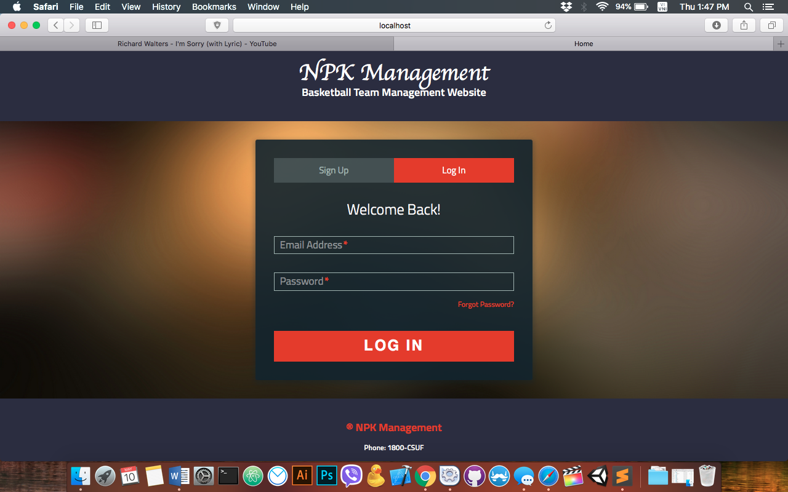
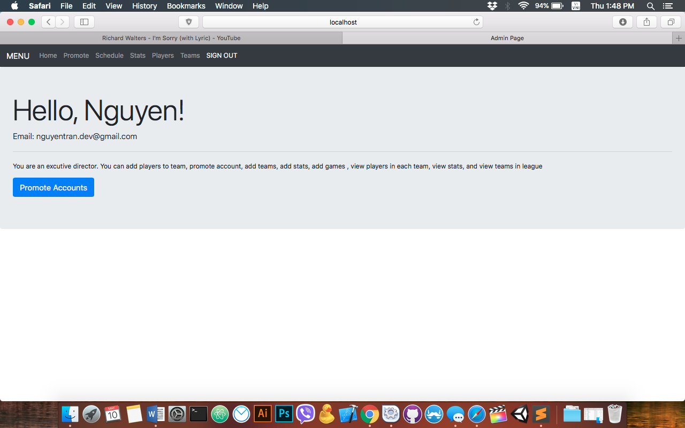
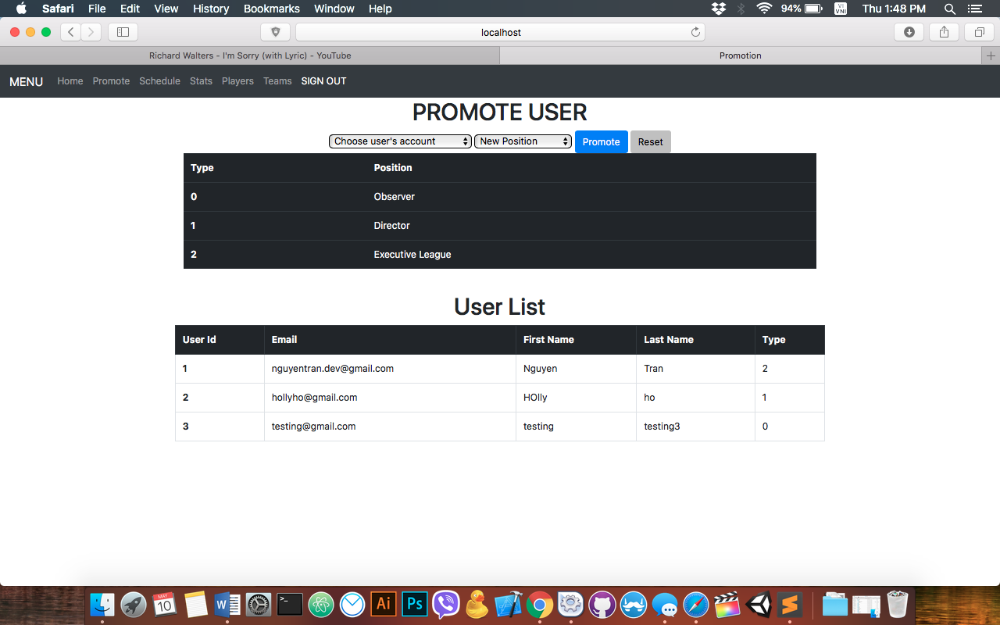
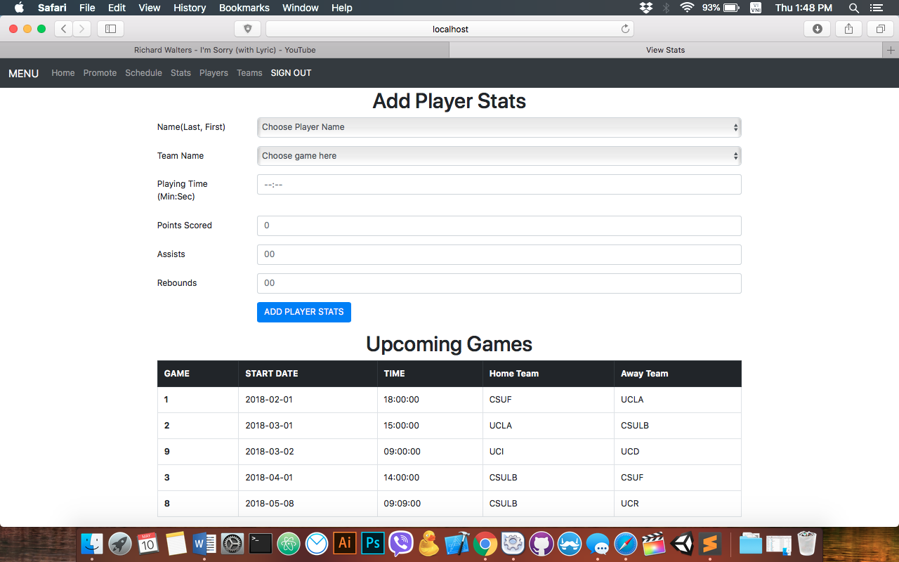
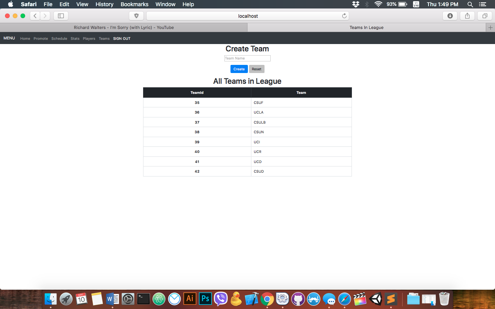

# NPKManagement

# Overview of the Project

1. Project Scope

2. Installation and Configuration

3. User Documentation

4. Technology We Used

5. Acknowledgement

6. License

# Project Scope

+ Project scope
++This application is a basketball team management site. The main features of this application consist of seeing game schedules, seeing players and their stats, and even the teams within the league -- simply keeping track of the players and their stats.

+ Project functionality
++This application has 3 types of user: the Observer, the Director, and the Exectutive Director.
++As an observer, you can see the front-end display of the application such as the stats, how many teams are in the leagues, etc. However, they cannot a player’s address for example. The observer sees the insensitive data, versus being able to see the sensitive data can only be seen by the admin.”  -- some of our use case questions consists of as a player can I view the team? If so how many games or what games can I see? What are the stats that I am able to view? 
++As a director, you can only see the View Team, View Stat, and View Games. The manager is also able to add players.” 
++As an executive director, you essentially have control over everything from viewing a team to removing players. 

# Installation and Configuration
## Prerequisites

You will need the following things properly installed on your computer.
* [Git](https://git-scm.com/)
* [PHP](http://php.net/downloads.php)
* [XAMPP](https://www.apachefriends.org/download.html)
* [Google Chrome](https://www.google.com/intl/en_ca/chrome/)

## Installation
* `git clone https://github.com/ntran273/npkmanagement.git`
* `Run XAMPP - Apache, PHP`
* `Go to folder htdocs in XAMPP and put all files into there`
* `Visit Link: http://localhost/phpmyadmin to import basketbal.ddl` 
* `Visit http://localhost/npkmanagement`

# User Documentation
## Screenshots of NPKManagement
### index.php

### admin/index.php

### admin/admin_promote.php

### admin/admin_createStats.php

### admin/createteam.php

# Technology Used

Languages
+ HTML5
+ Javascript
+ CSS3
+ PHP

Front-End
+ Bootstrap 4.0
+ Google Font APIs

Back-End
+ PHP
+ SQL

Development Tools
+ Atom

# Acknowledgements

-   **Professor Thomas Bettens** - _tbettens@fullerton.edu_ - California State University, Fullerton
-   **Professor Gina Ackerman** - _gackerman@fullerton.edu_ - California State University, Fullerton
-   **Clever Techie** - _<https://clevertechie.com/php/20/login-system-php-mysql-database>_

## Authors/Contributors

-   **Tran, Nguyen** - _ntran272@csu.fullerton.edu_ - [ntran273](https://github.com/ntran273)

